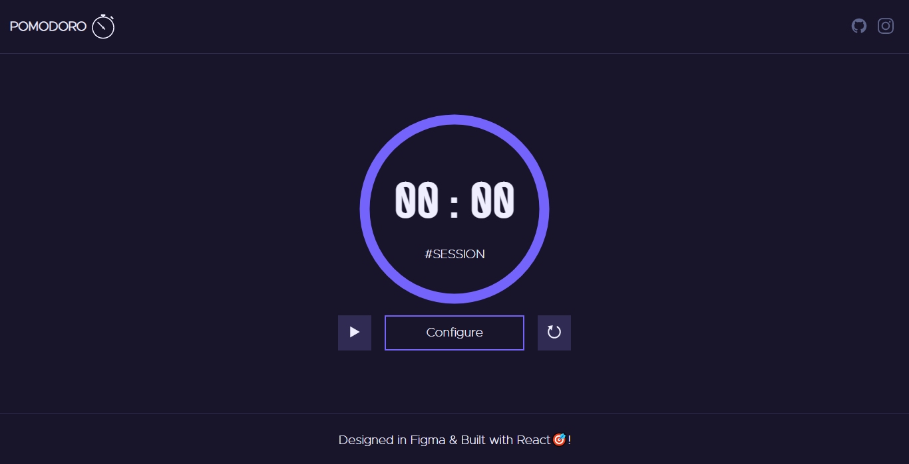

# Pomodoro UI

## 01. What is Pomodoro Timer?
Pomodoro Timer is simply a productivity or time management technique where you set the session time and break time. And basically, session time means that interval of time where you gonna focus/work without getting interrupted & break time is for the break.

Features. 
🏆Session and Break time (in Minutes) can be configured manually. 
🏆Completion of Session / Break is informed through the sound.

## 02. What React concepts I used?
1. Hooks ( useState, useEffect, useSound).
2. Forms.
3. Components and Props.

## 03. From where did you get the Inspiration. 
See it Live : https://pomodoro-astroud.vercel.app/
 
Github Repo : https://github.com/astroud/pomodoro-react-app
